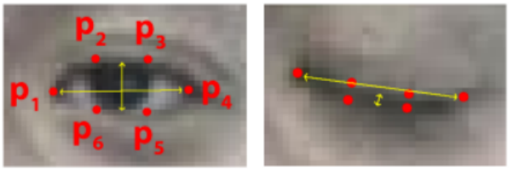

# FatigueDetection
&emsp;This is the project of driver fatigue detection, the input data is video captured by infrared camera. There are 4 sub project as following:

## Detect eye status(Open or Close)
&emsp;Using [dlib](https://github.com/davisking/dlib) to detect the 68 feature points, then using [EAR](http://cmp.felk.cvut.cz/ftp/articles/cech/Soukupova-CVWW-2016.pdf) to judge whether the eyes are open or closed.

    
     
    
Six feature points of human eyes

&emsp;Normally, EAR is larger when the eyes are open, and smaller when the eyes are closed. Therefore, the calculated EAR can be compared with a suitable threshold to determine whether the eyes are open or closed.

$$
EAR=\frac{\lVert p_{2}-p_{6}\rVert +\lVert p_{3}-p_{5}\rVert }{2\lVert p_{1}-p_{4}\rVert}
$$

## Detect calling(whether or not)
&emsp;To detect whether the driver is calling, what we do is detecting hand at the height of the face area.

## Detect face orientation(whether looking around or not)
&emsp;Refering to [Head Pose Estimation using OpenCV and Dlib](https://www.learnopencv.com/head-pose-estimation-using-opencv-and-dlib/), we can judge whether the driver is looking around depending on the face orientation.

## Detect mouth status(open or not)
&emsp;Similar to detect eye status, using a criterion similar to EAR called MAR to judge whether the mouth is open or not.
