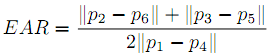
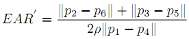
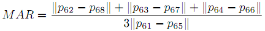
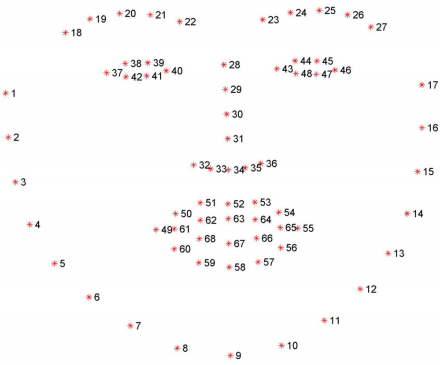

# FatigueDetection
&emsp;This is the project of driver fatigue detection, the input data is video captured by infrared camera. There are 4 sub project as following:

## Detect eye status(Open or Close)

### EAR

&emsp;Using [dlib](https://github.com/davisking/dlib) to detect the 68 feature points, then using [EAR](http://cmp.felk.cvut.cz/ftp/articles/cech/Soukupova-CVWW-2016.pdf) to judge whether the eyes are open or closed.

    
     
    
Six feature points of human eyes

&emsp;Normally, EAR is larger when the eyes are open, and smaller when the eyes are closed. Therefore, the calculated EAR can be compared with a suitable threshold to determine whether the eyes are open or closed.

    
     
    

### Modified EAR

&emsp;In order to reduce the error caused by the inaccuracy of a single detector, the face (eye) detector provided by Dlib library and the eye detector provided by opencv using Haar cascade classifier are used in the detection. Modified EAR is as follow:

    
     
    

&emsp;Where ρ is a penalty coefficient.

&emsp;Algorithm:

* For each frame of the video, use the ``getEAR()`` function to calculate the modified EAR value as follows:
    * Use Dlib detector to detect human face and eyes. If not, rotate and re-detect.
    * Based on the face detected by Dlib detector, the eye region is detected by Haar detector.
    * According to the eyes detected by Dlib detector, the standard EAR values of left and right eyes are calculated respectively.
    * The penalty coefficient is determined according to whether the haar detector detects the eye and the eye detected by the dlib detector is located in which part of the eye area detected by the haar detector.
    * Calculate modified EAR value and return.
* If the modified EAR value calculated in the previous step is less than the threshold value, it is considered as the closed eye state; if the modified EAR value is greater than the threshold value, the number of modified EAR values greater than the threshold value in the sliding window is calculated, only if more than half of the modified EAR values are greater than the threshold value, it is considered as the open eye state, otherwise it is still considered as the closed eye state.

## Detect calling(whether or not)
&emsp;To detect whether the driver is calling, what we do is detecting hand at the height of the face area. The main method used to detect whether to make a call here is to combine face detection and hand detection, because when calling, it is inevitable that the hand will reach the height of the face. Detect the hand within a certain height range of the face. When you reach the hand, you can think of it as a phone call.

&emsp;Algorithm:
* For each frame of the video, use the ``detectCalling()`` function to calculate the hand area and face area as follows:
    * Use the dlib detector to detect faces, if not detected, then rotate the image and re-detect.
    * According to the face detected by the dlib detector, calculate the number of pixels that exceed one third of the maximum gray value of the face as the face area (mainly to remove the background).
    * For the left area and the right area of the face (the upper edge of the area is the same as the upper edge of the face area, the distance between the lower edge and the upper edge is 1.5 times the height of the face, this is considering that the hand will be part of the lower edge (Below), the detection of hand area is as follows:
        * First, set the gray value of the left and right regions that deviate too much from the gray value range of the face to zero (remove the influence of most of the background), and then traverse the left and right regions. For each pixel, if it is not added to any connected components and is similar to the skin color of the face, it is taken as the starting point of a connected component.
        * For this pixel, calculate the difference between the pixel value of each pixel in the 8-neighbor area. If the difference between it and a pixel in the 8-neighbor area is within the threshold, and this pixel is not added to any connected component, then this pixel is also added to the connected component, and then repeat this process for this pixel, and finally get a connected component.
        * In this process, multiple connected components may be obtained, returning the largest area.
    * Calculate and return the ratio of hand area to face area.
* If the area ratio calculated in the previous step is less than the threshold and the area ratio less than the threshold in the sliding window is more than half, it is considered to be in a normal state, otherwise the driver is considered to be calling.

## Detect face orientation(whether looking around or not)
&emsp;Refering to [Head Pose Estimation using OpenCV and Dlib](https://www.learnopencv.com/head-pose-estimation-using-opencv-and-dlib/), we can judge whether the driver is looking around depending on the face orientation.

&emsp;The motion of a three-dimensional object to the camera can be divided into translation and rotation. The rotation can be expressed by the Euler angle. The Euler angle includes the pitch angle, roll angle and yaw angle. For a human face, the yaw angle corresponds to the left and right rotation of the face, so the yaw angle can be used to characterize the angle of the driver looking to the left and right to determine whether the driver is looking around.

&emdp;Algorithm:
* For each frame of the video, use the ``getYaw()`` function to calculate the yaw angle as follows:
    * Use the dlib detector to detect the face, if it is not detected, then rotate the image (because the rotation changes the roll angle, it will not affect the calculation of the yaw angle), re-detect, if still not detected after multiple try, directly believe that the driver is looking around.
    * Based on the 6 feature points detected by the dlib detector for attitude estimation, calculate the yaw angle using the ``calculateYaw()`` function
* If the yaw angle calculated in the previous step is within the normal yaw angle range, and the number of normal states in the sliding window is more than half, the face orientation is considered to be in normal state, otherwise, the driver is considered to be looking around.

## Detect mouth status(open or not)
&emsp;Similar to detect eye status, using a criterion similar to EAR called MAR to judge whether the mouth is open or not. Referring to the EAR idea mentioned in the previous eye state detection, a parameter MAR (mouth aspect ratio) for judging the opening and closing state of the mouth is proposed for mouth state detection as follows:

    
     
    

    
     
    

&emsp;Among the 68 feature points of the face, 8 points corresponding to the inner contour of the mouth are used.

&emsp;Algorithm:
* For each frame of the video, use the ``getMAR()`` function to calculate the MAR value as follows:
    * Use the dlib detector to detect the face and mouth, if not detected, then rotate the image and re-detect.
    * Calculate the MAR value based on the 8 feature points of the inner contour of the mouth detected by the dlib detector.
* If the MAR value calculated in the previous step is greater than the threshold, the mouth is considered to be open; if the MAR value is less than the threshold, the number of MAR values in the sliding window that are less than the threshold is calculated, only when more than half of the MAR values are less than the threshold, the mouth is considered to be in a closed state, otherwise the mouth is still considered to be in an open state.
